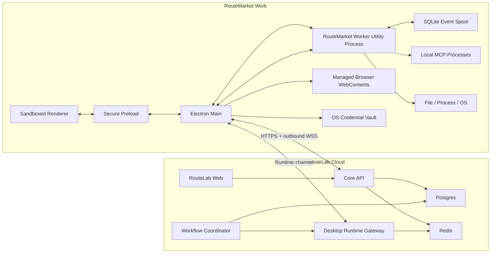
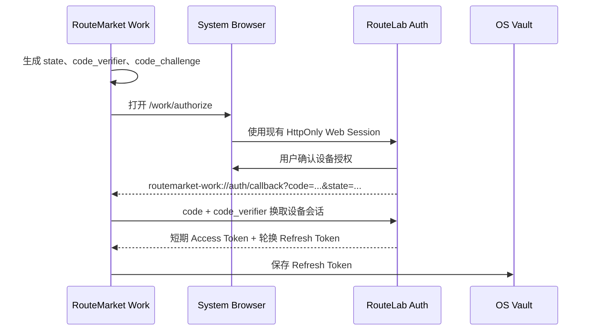
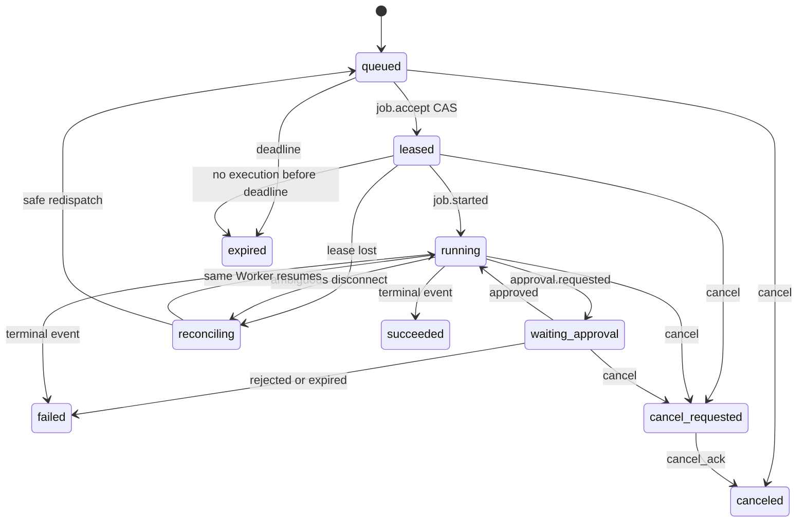

# RouteMarket Work Phase 0 技术设计

> 状态：技术设计稿
> 日期：2026-07-17
> 桌面端仓库：`C:\PX Labs\PX06\RouteMarket-Desktop`
> 云端仓库：`D:\PX Labs\PX06-RouteLab`
> 关联文档：`RouteMarket-Work-Product-Architecture-Plan.md`

## 1. 目标

Phase 0 不追求一次完成完整桌面工作台，而是建立 RouteMarket Work 与 RouteLab 之间可信、可恢复、可审计的本地执行闭环。

首个纵向切片：

```text
RouteLab 创建 Desktop Job
  -> 通过 WSS 派发给指定 RouteMarket Worker
  -> Worker 校验项目绑定、Capability 和权限
  -> Worker 读取项目 README
  -> Worker 持久化并上报事件与结果
  -> RouteLab 更新 WorkflowNodeRun
  -> RouteLab 自动恢复 WorkflowRun
  -> RouteMarket Work 显示完整运行时间线
```

Phase 0 要证明的不是“桌面端能够调用一个本地函数”，而是以下工程事实：

- 本地能力只能由经过授权的 Worker 执行。
- Renderer、网页内容和模型都不能直接获得本机权限。
- 网络断开、进程重启和事件重放不会造成重复执行。
- Workflow 可以持久化等待桌面节点，而不是在内存中长期阻塞。
- 本地操作的输入、审批、结果和错误可以进入统一运行记录。
- RouteLab 仍然是混合 Workflow 的唯一运行事实来源。

## 2. 非目标

Phase 0 明确不包含：

- 完整项目工作台和代码编辑器。
- 完整 React Flow Workflow Studio。
- Shell、长驻进程和文件写入的全部产品体验。
- 内置浏览器自动化的完整实现。
- Local MCP 安装市场。
- Attached Chrome/Edge。
- 纯本地离线 Workflow。
- 远程无人值守触发。
- Team/Enterprise 设备治理。
- 桌面自动更新正式发布链路。

这些能力会使用 Phase 0 建立的身份、协议、权限和 Job 基础继续实现。

## 3. 已确认的 RouteLab 基础

### 3.1 可以直接复用

RouteLab 当前已有：

- `UserWorkflow.nodes`、`edges`、`settings` JSON 存储。
- 未知 Workflow 节点字段的无损保存能力。
- `WorkflowRun.graphSnapshot`。
- `WorkflowNodeRun` 节点级状态和输出持久化。
- 节点重试、超时、取消、计费和退款语义。
- 已成功节点的恢复复用，避免重复调用和重复收费。
- `/api/chat` SSE、多模型、Agent、附件和工具调用。
- Cookie/Bearer Session 认证基础。
- 统一 Membership、Plan Feature 和 Credits 体系。
- Postgres 作为任务状态事实来源、Redis 作为队列协调层的工程经验。

### 3.2 不能直接套用

现有 Workflow 执行仍主要是一个进程内 DAG 执行循环。节点虽然有持久化记录，但等待本机执行时仍缺少：

- 持久化 suspend/resume continuation。
- 设备定向派发。
- WSS Runtime 通道。
- Job 租约和断线恢复。
- 本地审批。
- Worker 事件补传。
- 本地 Capability 校验。

现有 `AsyncTask` 可以借鉴数据库优先、Redis 协调、CAS Claim、幂等和协作取消的模式，但不能直接作为 Desktop Job 使用。Desktop Job 还需要项目绑定、交互审批、设备连接、租约续期和副作用不确定性处理。

RouteLab 当前的 `ws` 使用点主要是连接上游模型服务，不是面向 RouteMarket Work 的入站 WebSocket 服务。

## 4. RouteLab 主站改造清单

### 4.1 Phase 0 必须改造

| 编号 | 模块 | 改造内容 | 交付结果 |
|---|---|---|---|
| RL-01 | Desktop Auth | 增加一次性授权码、PKCE、设备 Access/Refresh Session、撤销和轮换 | 桌面端无需读取 Web Cookie 即可安全登录 |
| RL-02 | Entitlement | 增加 Work 权益投影接口和服务端强制校验 | 桌面端与主站共用一套会员 |
| RL-03 | Runtime Registry | 增加 Runtime 注册、设备信息、心跳、在线状态和禁用 | RouteLab 可以识别用户的 Worker |
| RL-04 | Capability Registry | 保存版本化 Capability Manifest、Hash 和 Revision | 派发前可判断设备是否具备能力 |
| RL-05 | Project Binding | 增加本地项目与 Runtime 的不透明绑定记录 | 云端引用项目但不获取绝对路径 |
| RL-06 | Runtime WSS | 新增面向 Worker 的入站 WSS、鉴权、心跳和重连 | Worker 主动向外建立长期连接 |
| RL-07 | Desktop Job | 新增 Job、事件、租约、幂等、取消和结果持久化 | 云端能够可靠派发本地工作 |
| RL-08 | Approval Projection | 保存审批摘要和处理结果，不保存本地秘密 | 云端运行记录可以解释等待原因 |
| RL-09 | Workflow Suspend | Workflow 遇到桌面节点时持久化进入等待状态 | 不长期占用内存 Promise |
| RL-10 | Workflow Resume | Job 成功后写入节点结果并自动恢复 Workflow | 后续云端节点继续执行 |
| RL-11 | Strict Persistence | 混合 Workflow 的 Run、Node Run 和 Desktop Job 持久化失败时禁止执行 | 避免产生无运行记录的本地副作用 |
| RL-12 | Run Cancellation | Workflow 取消向活动 Desktop Job 扇出并等待 Cancel ACK | 云端和桌面取消状态一致 |
| RL-13 | Observability | 增加 Runtime、Job、租约、事件积压和失败指标 | 可定位断线、重复、超时和恢复问题 |

### 4.2 Phase 0 主站 Web 兼容性改造

| 编号 | 页面/模块 | 改造内容 |
|---|---|---|
| WEB-01 | Workflow 序列化 | 增加 `schemaVersion`、`executionTarget`、`portability` 和节点定义摘要 |
| WEB-02 | 未知节点 | 不认识桌面节点时显示通用只读占位符，保留端口、配置和连线 |
| WEB-03 | Workflow 校验 | 标记“需要 RouteMarket Work”，不能自动替换为云端节点 |
| WEB-04 | 运行详情 | 显示等待 Worker、等待审批、Worker 离线、正在重连和取消中 |
| WEB-05 | Deep Link | 提供 `routemarket-work://` 打开桌面项目、Workflow 或 Run |
| WEB-06 | 设备入口 | 提供基础设备列表、最后在线时间和撤销设备会话 |

Phase 0 不要求 Web 端能够编辑桌面专属节点，只要求无损保存、正确显示和不破坏 Workflow。

### 4.3 MVP/V1 再改造

- Workflow 桌面节点注册表 API。
- Web 创建的 Workflow 选择目标 Runtime。
- 远程触发和无人值守策略。
- 设备并发和在线 Worker 增值权益。
- Team 设备共享、RBAC、审计和远程禁用。
- Workflow/Agent/Skill 市场的桌面兼容性声明。
- Attached Browser 和浏览器 Profile 管理。

### 4.4 不需要改造

- RouteMarket 账号主体。
- Membership 和 Credits 基础账单。
- 模型网关和 Provider 路由。
- Agent Profile 主体。
- 云端 MCP 和 Skill 主体。
- Workflow JSON 基础存储。
- 云端生成资产系统。

## 5. 总体拓扑



Worker 和 Main 只建立出站连接，用户不需要开放本机端口。

## 6. Electron 进程与信任边界

### 6.1 Renderer

Renderer 只负责界面：

- 项目、聊天、Workflow、运行时间线和审批 UI。
- 不启用 Node Integration。
- 开启 `contextIsolation`、sandbox 和严格 CSP。
- 不读取设备 Refresh Token、文件系统、环境变量或 MCP 子进程。
- 不接受任意网页向 Preload 发送特权调用。

Renderer 被视为可能受到 XSS、第三方内容或恶意项目预览影响的低信任区域。

### 6.2 Preload

Preload 只暴露固定、版本化 API：

```ts
type WorkDesktopApi = {
  protocolVersion: "1";
  project: {
    openFolder(): Promise<ProjectSummary>;
    list(): Promise<ProjectSummary[]>;
    read(uri: string, range?: TextRange): Promise<FileReadResult>;
  };
  runtime: {
    status(): Promise<RuntimeStatus>;
  };
  approvals: {
    listPending(): Promise<ApprovalSummary[]>;
    resolve(input: ApprovalResolutionInput): Promise<void>;
  };
};
```

禁止提供：

- 通用 `ipcRenderer.send(channel, payload)`。
- 任意文件路径读取。
- 任意 Shell 字符串执行。
- 任意 Electron API 透传。

### 6.3 Electron Main

Main 负责：

- Window、Tray、Deep Link 和应用生命周期。
- 系统浏览器授权回调。
- OS Credential Vault。
- Cloud Session 和短期 Access Token。
- WSS 连接与重连。
- Worker Utility Process 的启动、健康检查和重启。
- Managed Browser 的 `WebContents`、Session 和下载。
- 对来自 Worker 的浏览器/凭据请求做第二次边界校验。

长期 Refresh Token 只允许 Main 通过 Vault 获取。Worker 只接收短期 Access Token，不持有长期登录凭据。

### 6.4 RouteMarket Worker

Worker 使用 Electron `utilityProcess` 或受控 Node 子进程运行：

- Project Service。
- Tool Broker。
- Capability 探测。
- 文件、进程和 MCP 执行。
- 权限策略与本地审批。
- SQLite Event Spool。
- Job 幂等和恢复。

Worker 不拥有创建任意 Renderer Window 的能力，也不直接读取长期云端凭据。

### 6.5 Main 与 Worker IPC

IPC 使用带 Schema 的请求/响应 Envelope：

```json
{
  "protocol": "work-ipc/1",
  "requestId": "req_01...",
  "method": "job.execute",
  "params": {}
}
```

要求：

- 所有方法使用 allowlist。
- 请求和响应均进行 JSON Schema 校验。
- 默认单消息不超过 1 MiB。
- 大文件只传 Project URI、临时句柄或流式通道。
- 每个特权请求必须包含 `jobId`、`projectBindingId` 和审批决策引用。
- IPC 日志必须脱敏。

## 7. Desktop 登录与设备会话

### 7.1 授权流程



### 7.2 安全要求

- 授权码只能使用一次，建议 60 秒过期。
- 必须使用 PKCE S256。
- `state` 必须在 Main 本地校验。
- 授权码只绑定一个 `codeChallenge`、用户、设备请求和 Redirect URI。
- Access Token 建议 15 分钟过期。
- Refresh Token 建议 30 天滑动过期并每次刷新轮换。
- Refresh Token 只保存 Hash，明文只进入 OS Vault。
- Refresh Token 重用触发该设备 Session 全部撤销。
- WSS Upgrade 使用 `Authorization: Bearer`，禁止把 Token 放在 URL Query。
- Renderer 不能读取任何 Token。

### 7.3 新增接口

```text
GET  /api/app/v1/work/authorize
POST /api/app/v1/work/auth/token
POST /api/app/v1/work/auth/refresh
POST /api/app/v1/work/auth/revoke
GET  /api/app/v1/work/auth/devices
```

## 8. Entitlement

新增稳定接口：

```text
GET /api/app/v1/work/entitlements
```

示例响应：

```json
{
  "schemaVersion": 1,
  "features": {
    "work.desktop.basic": true,
    "work.hybrid_workflow": true,
    "work.remote_trigger": false,
    "work.project_sync": false,
    "work.browser.advanced": false
  },
  "limits": {
    "work.worker.max_devices": 2,
    "work.worker.max_concurrency": 1
  },
  "evaluatedAt": "2026-07-17T08:00:00.000Z"
}
```

规则：

- 响应由现有 Membership Plan `features` 投影产生。
- 桌面端可以用它控制 UI，但服务端必须再次强制校验。
- 权益短时缓存，失效时不终止已经接受的本地安全操作。
- 会员降级后禁止接受新的超限 Job，不强杀正在写文件的 Job。

## 9. Runtime 注册与 Capability Manifest

### 9.1 Runtime 身份

首次启动生成本地 `deviceId` 和密钥材料，注册后获得云端 `runtimeId`。

`deviceId` 表示安装实例，`runtimeId` 表示 RouteLab 中属于某用户的 Worker 记录。重装应用会生成新设备，不通过硬件指纹追踪用户。

### 9.2 注册接口

```text
POST   /api/app/v1/work/runtimes/register
GET    /api/app/v1/work/runtimes
GET    /api/app/v1/work/runtimes/:runtimeId
PUT    /api/app/v1/work/runtimes/:runtimeId/capabilities
POST   /api/app/v1/work/runtimes/:runtimeId/heartbeat
DELETE /api/app/v1/work/runtimes/:runtimeId
WSS    /api/app/v1/work/runtime-channel
```

HTTP Heartbeat 是 WSS 不可用时的降级手段，正常在线状态主要由 WSS Session 和心跳确定。

### 9.3 Capability Manifest

```json
{
  "schemaVersion": 1,
  "revision": 12,
  "generatedAt": "2026-07-17T08:00:00.000Z",
  "runtime": {
    "platform": "windows",
    "arch": "x64",
    "appVersion": "0.1.0",
    "workerVersion": "0.1.0"
  },
  "limits": {
    "maxConcurrentJobs": 1,
    "maxInlineResultBytes": 262144
  },
  "capabilities": [
    {
      "key": "local.fs.read",
      "version": 1,
      "risk": "R0",
      "operations": ["read_text", "stat", "list"]
    }
  ],
  "projects": [
    {
      "projectBindingId": "dpb_01...",
      "localProjectId": "project_01...",
      "access": ["read"],
      "rootFingerprint": "sha256:..."
    }
  ],
  "mcpServers": []
}
```

Manifest 禁止包含：

- 本机绝对路径。
- 用户名和 Home 路径。
- 环境变量内容。
- Cookie、Token、API Key。
- MCP 配置中的 Secret。

Manifest 使用规范化 JSON 计算 `manifestHash`。每次变化递增 `revision`，RouteLab 使用 CAS 防止旧 Manifest 覆盖新版本。

## 10. 项目绑定

### 10.1 本地结构

打开文件夹时，Worker 生成本地 `localProjectId`。只有用户确认关联云端能力后才注册 `DesktopProjectBinding`。

协议只使用：

```text
project://<localProjectId>/README.md
```

云端不发送或保存：

```text
C:\Users\name\project\README.md
/Users/name/project/README.md
```

### 10.2 URI 解析

每次文件操作必须：

1. 根据 `localProjectId` 找到已授权根目录。
2. 解码并拒绝 NUL、非法分隔符和设备路径。
3. 规范化相对路径。
4. 解析父目录和符号链接/Junction 的真实路径。
5. 确认最终目标仍位于项目根目录内。
6. 写入前再次校验，降低 TOCTOU 风险。

项目根目录移动或指纹不匹配时，Job 进入 `PROJECT_REBIND_REQUIRED`，不能猜测新路径。

## 11. WSS Runtime 协议

### 11.1 连接原则

- WSS 是低延迟命令和事件通道。
- Postgres 是 Job 状态事实来源。
- Redis 只负责把命令路由到持有 Runtime Socket 的 API 实例。
- WSS 断开不改变 Job 的最终事实。
- HTTPS Job/Event API 作为补传和故障降级通道。

Phase 0 可以在 Core API 增加 `DesktopRuntimeGateway`。生产扩容后，如果长连接规模显著增加，再拆分独立 Relay Service。

### 11.2 Envelope

```json
{
  "protocol": "routemarket-work/1",
  "messageId": "msg_01...",
  "type": "job.offer",
  "sentAt": "2026-07-17T08:00:00.000Z",
  "payload": {}
}
```

### 11.3 云端到 Worker

```text
session.ready
runtime.ping
runtime.capability_refresh
auth.expiring
job.offer
job.cancel
job.event_ack
job.event_nack
```

### 11.4 Worker 到云端

```text
runtime.hello
runtime.resume
runtime.heartbeat
runtime.pong
job.accept
job.reject
job.event
job.cancel_ack
```

### 11.5 重连握手

Worker 重连后发送：

```json
{
  "type": "runtime.resume",
  "payload": {
    "runtimeId": "runtime_01...",
    "connectionNonce": "nonce_01...",
    "manifestRevision": 12,
    "activeJobs": [
      {
        "jobId": "djob_01...",
        "leaseId": "lease_01...",
        "localStatus": "running",
        "lastProducedSeq": 18,
        "lastAckedSeq": 15
      }
    ]
  }
}
```

云端响应每个 Job 的动作：

```text
continue
resend_from_seq
cancel
reconcile
forget
```

## 12. Desktop Job

### 12.1 Job 内容

```json
{
  "jobId": "djob_01...",
  "workflowRunId": "run_01...",
  "workflowNodeRunId": "nrun_01...",
  "runtimeId": "runtime_01...",
  "projectBindingId": "dpb_01...",
  "executorKey": "local.fs.read",
  "executorVersion": 1,
  "input": {
    "uri": "project://project_01/README.md",
    "maxBytes": 65536
  },
  "requiredCapabilities": ["local.fs.read"],
  "executionClass": "pure_read",
  "approvalPolicy": {
    "risk": "R0",
    "mode": "project_grant"
  },
  "idempotencyKey": "sha256:...",
  "deadlineAt": "2026-07-17T08:10:00.000Z",
  "maxInlineResultBytes": 262144
}
```

### 12.2 状态机



终态：

```text
succeeded | failed | canceled | expired
```

`reconciling` 不是失败，它表示云端不能确定本机副作用是否已经发生。

### 12.3 租约

- `job.accept` 使用数据库 CAS 从 `queued` 转为 `leased`。
- 云端生成 `leaseId` 和递增 `leaseEpoch`。
- 建议初始租约 30 秒，Worker 每 10 秒续期。
- Socket 短暂断开时保留 60 秒恢复宽限期。
- 所有 Job Event 必须带当前 `leaseId` 和 `leaseEpoch`。
- 旧租约事件只能作为审计记录，不能改变当前 Job 状态。

### 12.4 执行分类与重复处理

```text
pure_read
idempotent_write
external_side_effect
```

- `pure_read`：租约确认失效后可以安全重新派发。
- `idempotent_write`：只有 Tool Adapter 能证明幂等时才重新派发。
- `external_side_effect`：租约失效后进入 `reconciling`，禁止自动重做。

系统承诺的是“至少一次消息投递 + 幂等执行协议”，不对任意外部副作用宣称理论上的 exactly-once。

### 12.5 Job 事件

Worker 为每个 Job 维护单调递增 `seq`：

```text
job.accepted
job.started
job.progress
job.log
approval.requested
approval.resolved
artifact.ready
job.succeeded
job.failed
job.canceled
```

规则：

- `(jobId, source, seq)` 唯一。
- `eventId` 全局唯一。
- `seq <= lastAckedSeq` 视为重复并返回已有 ACK。
- 出现 Gap 时云端返回 `resend_from_seq`。
- Job 状态更新和事件插入在同一数据库事务中完成。
- 单事件建议不超过 64 KiB。
- Inline Result 建议不超过 256 KiB。
- 大结果先使用签名上传，再通过 `artifactRef` 上报。
- 日志需要截断、分块和 Secret Redaction。

### 12.6 HTTP 降级接口

```text
GET  /api/app/v1/work/jobs/:jobId
POST /api/app/v1/work/jobs/:jobId/accept
POST /api/app/v1/work/jobs/:jobId/events
POST /api/app/v1/work/jobs/:jobId/cancel-ack
POST /api/app/v1/work/jobs/:jobId/reconcile
```

WSS 和 HTTP 共享同一状态转换服务，不能维护两套 Job 逻辑。

## 13. Workflow 持久化等待与恢复

### 13.1 需要补充的状态

建议扩展：

```text
WorkflowRun:
queued | running | waiting_desktop | cancel_requested |
succeeded | failed | partial | canceled

WorkflowNodeRun:
pending | running | waiting_desktop | waiting_approval |
succeeded | failed | skipped | canceled
```

Worker 离线和等待审批不是节点失败，不应写成 `failed`。

### 13.2 Suspend

当执行器遇到 `executionTarget=desktop`：

1. 必须已经存在 `WorkflowRun` 和 `WorkflowNodeRun`。
2. 校验 Entitlement、Runtime、Project Binding 和 Capability。
3. 创建 Desktop Job。
4. 将 Node Run 更新为 `waiting_desktop`。
5. 将 Workflow Run 更新为 `waiting_desktop`。
6. 提交事务后派发 `job.offer`。
7. 当前 DAG 执行返回可识别的 `WorkflowSuspended`，不能进入普通失败逻辑。

同一 Stage 已经开始的兄弟节点可以完成并持久化。恢复时复用这些成功结果。

### 13.3 Resume

Job 成功后：

1. 校验 Job 当前租约和终态事件。
2. 将 Desktop Result 转换为 `outputsByPort`。
3. 将对应 `WorkflowNodeRun` 更新为 `succeeded`。
4. 确认该 Run 没有其他非终态 Desktop Job。
5. 使用数据库互斥锁/CAS 抢占 Resume 权。
6. 调用现有 Resume 机制，从 `graphSnapshot` 恢复。
7. 已成功节点不重做、不重收费。

Job 失败后将 Node Run 和 Workflow Run 更新为失败；是否允许用户重跑由节点 Retry Policy 和执行分类决定。

### 13.4 严格持久化

现有 Workflow Run/Node Run 持久化是 Best Effort。对混合 Workflow 必须改为 Strict：

- Run 创建失败：不执行。
- Node Run 创建失败：不创建 Desktop Job。
- Job 创建失败：不派发。
- Job Event 持久化失败：不 ACK。
- Node Result 写入失败：不 Resume。

这是为了避免本地已经产生副作用，但云端没有任何事实记录。

## 14. Chat Tool Broker 接入

RouteLab Web 当前在浏览器客户端执行工具循环。RouteMarket Work 仍可调用相同 Chat SSE，但本地工具必须由 Desktop Runtime 执行。

桌面 Chat Runtime 流程：

```text
RouteLab SSE 返回 tool_call
  -> Desktop Chat Runtime 解析 Tool Schema
  -> Desktop Tool Broker 判定 cloud/desktop
  -> cloud Tool 调用 RouteLab API
  -> desktop Tool 创建本地 Invocation/Approval
  -> Worker 执行并返回结构化 tool_result
  -> 下一轮 Chat 请求携带 assistant tool_call + tool result
```

要求：

- 不直接复制 Web 的 `executeToolCall()`。
- 本地 Tool 必须经过同一个 Tool Broker、权限和审批系统。
- Tool Call ID 作为幂等键的一部分。
- Chat 取消必须传递到本地 Tool Invocation。
- Phase 0 可以先打通 Workflow Job，Chat 本地工具在 MVP 接入同一 Worker API。

## 15. Capability 与权限模型

### 15.1 最终执行权

RouteLab 可以请求某项能力，但本地 Worker 始终拥有最终拒绝权。

有效授权由以下交集决定：

```text
会员权益
∩ 云端 Runtime/Workflow 策略
∩ 当前设备 Capability
∩ 项目 Grant
∩ Workflow/Agent/Skill Grant
∩ 本次 Invocation Approval
```

任意一层拒绝即不执行。

### 15.2 风险等级

| 等级 | 示例 | Phase 0 默认 |
|---|---|---|
| R0 | 项目内读文件、列目录 | 用户打开并授权项目后允许 |
| R1 | 写入、Patch、新建导出物 | 展示目标或 Diff，可按项目授权 |
| R2 | Shell、启动程序、提交表单 | 每次或本次运行审批 |
| R3 | 删除、付款、发布、安装、系统设置 | 每次审批，不能记住 |

### 15.3 Approval 状态

```text
pending
approved_once
approved_for_run
rejected
expired
canceled
```

审批请求必须绑定规范化动作 Hash：

```text
actionHash = sha256(
  toolName + canonicalArgs + projectBindingId +
  jobId + leaseId + riskLevel
)
```

参数、目标项目或租约变化后，旧审批立即失效。

Phase 0 审批只允许在本机确认。云端保存可审计摘要和结果，不提供远程批准高风险本机操作。

## 16. 本地 SQLite

建议开启：

```text
WAL
foreign_keys=ON
busy_timeout=5000
```

核心表：

```text
runtime_identity
  runtime_id, device_id, created_at

project_bindings
  id, local_project_id, root_path_encrypted, root_fingerprint,
  permission_revision, created_at, updated_at

capability_snapshots
  revision, manifest_hash, manifest_json, created_at

inbound_commands
  command_id, type, payload_hash, status, received_at, completed_at

local_jobs
  job_id, idempotency_key, lease_id, lease_epoch, status,
  executor_key, project_binding_id, input_hash,
  result_ref, created_at, updated_at

job_event_outbox
  job_id, seq, event_id, type, payload_encrypted,
  created_at, acked_at

approvals
  approval_id, job_id, action_hash, risk_level, status,
  decision_scope, created_at, resolved_at

permission_grants
  grant_id, project_binding_id, subject_type, subject_id,
  capability, risk_level, scope, expires_at

process_handles
  handle_id, job_id, pid, process_group_id, status, created_at

mcp_servers
  server_id, scope, config_encrypted, tools_hash, status
```

规则：

- Refresh Token 不进入 SQLite。
- 绝对路径、MCP 配置和敏感事件 Payload 使用由 OS Vault 保存的数据密钥进行 AES-GCM 字段加密。
- Job 的 Idempotency Key 和终态结果必须在发送云端事件前提交。
- Outbox ACK 后按保留策略清理，不能一发送就删除。

## 17. RouteLab Prisma 新增模型草案

以下是字段方向，不是最终迁移文件：

```prisma
model DesktopDeviceSession {
  id               String   @id @default(uuid()) @db.Uuid
  userId           String   @map("user_id") @db.Uuid
  deviceId         String   @map("device_id")
  refreshTokenHash String   @unique @map("refresh_token_hash")
  tokenFamilyId    String   @map("token_family_id") @db.Uuid
  scopes           Json     @default("[]")
  status           String   @default("active")
  expiresAt        DateTime @map("expires_at") @db.Timestamptz(6)
  lastUsedAt       DateTime? @map("last_used_at") @db.Timestamptz(6)
  revokedAt        DateTime? @map("revoked_at") @db.Timestamptz(6)
  createdAt        DateTime @default(now()) @map("created_at") @db.Timestamptz(6)
  updatedAt        DateTime @updatedAt @map("updated_at") @db.Timestamptz(6)

  @@index([userId, status])
  @@map("desktop_device_sessions")
}

model DesktopRuntime {
  id                 String   @id @default(uuid()) @db.Uuid
  userId             String   @map("user_id") @db.Uuid
  deviceId           String   @map("device_id")
  displayName        String   @map("display_name")
  platform           String
  arch               String
  appVersion         String   @map("app_version")
  workerVersion      String   @map("worker_version")
  status             String   @default("offline")
  manifestRevision   Int      @default(0) @map("manifest_revision")
  manifestHash       String?  @map("manifest_hash")
  capabilityManifest Json?    @map("capability_manifest")
  maxConcurrency     Int      @default(1) @map("max_concurrency")
  lastSeenAt         DateTime? @map("last_seen_at") @db.Timestamptz(6)
  disabledAt         DateTime? @map("disabled_at") @db.Timestamptz(6)
  createdAt          DateTime @default(now()) @map("created_at") @db.Timestamptz(6)
  updatedAt          DateTime @updatedAt @map("updated_at") @db.Timestamptz(6)

  @@unique([userId, deviceId])
  @@index([userId, status])
  @@map("desktop_runtimes")
}

model DesktopProjectBinding {
  id                String   @id @default(uuid()) @db.Uuid
  userId            String   @map("user_id") @db.Uuid
  runtimeId         String   @map("runtime_id") @db.Uuid
  localProjectId    String   @map("local_project_id")
  displayName       String?  @map("display_name")
  rootFingerprint   String   @map("root_fingerprint")
  permissionSummary Json     @default("{}") @map("permission_summary")
  status            String   @default("active")
  lastSeenAt        DateTime? @map("last_seen_at") @db.Timestamptz(6)
  createdAt         DateTime @default(now()) @map("created_at") @db.Timestamptz(6)
  updatedAt         DateTime @updatedAt @map("updated_at") @db.Timestamptz(6)

  @@unique([runtimeId, localProjectId])
  @@index([userId, status])
  @@map("desktop_project_bindings")
}

model DesktopJob {
  id                   String   @id @default(uuid()) @db.Uuid
  jobId                String   @unique @map("job_id")
  userId               String   @map("user_id") @db.Uuid
  workflowRunId        String   @map("workflow_run_id") @db.Uuid
  workflowNodeRunId    String   @map("workflow_node_run_id") @db.Uuid
  runtimeId            String   @map("runtime_id") @db.Uuid
  projectBindingId     String?  @map("project_binding_id") @db.Uuid
  status               String   @default("queued")
  executorKey          String   @map("executor_key")
  executorVersion      Int      @default(1) @map("executor_version")
  executionClass       String   @map("execution_class")
  requiredCapabilities Json     @map("required_capabilities")
  approvalPolicy       Json     @default("{}") @map("approval_policy")
  input                Json
  output               Json?
  error                Json?
  idempotencyKey       String   @map("idempotency_key")
  leaseId              String?  @map("lease_id")
  leaseEpoch           Int      @default(0) @map("lease_epoch")
  leaseExpiresAt       DateTime? @map("lease_expires_at") @db.Timestamptz(6)
  nextExpectedSeq      Int      @default(1) @map("next_expected_seq")
  cancelRequested      Boolean  @default(false) @map("cancel_requested")
  deadlineAt           DateTime @map("deadline_at") @db.Timestamptz(6)
  acceptedAt           DateTime? @map("accepted_at") @db.Timestamptz(6)
  startedAt            DateTime? @map("started_at") @db.Timestamptz(6)
  completedAt          DateTime? @map("completed_at") @db.Timestamptz(6)
  createdAt            DateTime @default(now()) @map("created_at") @db.Timestamptz(6)
  updatedAt            DateTime @updatedAt @map("updated_at") @db.Timestamptz(6)

  @@unique([runtimeId, idempotencyKey])
  @@index([runtimeId, status, createdAt])
  @@index([workflowRunId, status])
  @@index([leaseExpiresAt])
  @@map("desktop_jobs")
}

model DesktopJobEvent {
  id         String   @id @default(uuid()) @db.Uuid
  eventId    String   @unique @map("event_id")
  jobId      String   @map("job_id") @db.Uuid
  source     String
  seq        Int
  type       String
  payload    Json
  occurredAt DateTime @map("occurred_at") @db.Timestamptz(6)
  receivedAt DateTime @default(now()) @map("received_at") @db.Timestamptz(6)

  @@unique([jobId, source, seq])
  @@index([jobId, receivedAt])
  @@map("desktop_job_events")
}

model DesktopApproval {
  id          String   @id @default(uuid()) @db.Uuid
  approvalId  String   @unique @map("approval_id")
  jobId       String   @map("job_id") @db.Uuid
  actionHash  String   @map("action_hash")
  riskLevel   String   @map("risk_level")
  status      String   @default("pending")
  summary     Json
  resolution  Json?
  expiresAt   DateTime @map("expires_at") @db.Timestamptz(6)
  resolvedAt  DateTime? @map("resolved_at") @db.Timestamptz(6)
  createdAt   DateTime @default(now()) @map("created_at") @db.Timestamptz(6)

  @@index([jobId, status])
  @@map("desktop_approvals")
}
```

正式迁移时需要补全 `UserAccount`、`WorkflowRun`、`WorkflowNodeRun` 和各 Desktop Model 的 relation。

## 18. 错误码

建议使用稳定机器码：

```text
AUTH_DEVICE_REVOKED
AUTH_TOKEN_REUSED
ENTITLEMENT_REQUIRED
RUNTIME_OFFLINE
RUNTIME_DISABLED
RUNTIME_VERSION_UNSUPPORTED
CAPABILITY_MISSING
CAPABILITY_REVISION_MISMATCH
PROJECT_NOT_BOUND
PROJECT_REBIND_REQUIRED
PROJECT_PATH_ESCAPE
APPROVAL_REQUIRED
APPROVAL_REJECTED
APPROVAL_EXPIRED
JOB_LEASE_LOST
JOB_EVENT_GAP
JOB_ALREADY_TERMINAL
JOB_RECONCILIATION_REQUIRED
JOB_DEADLINE_EXCEEDED
TOOL_INPUT_INVALID
TOOL_OUTPUT_TOO_LARGE
TOOL_CANCELED
```

错误消息可以本地化，但状态机只能依赖错误码。

## 19. 断线、取消和恢复

### 19.1 WSS 断线

- 断线不立即把 Runtime 标记为永久离线。
- 30 秒没有心跳标记 `degraded`。
- 超过恢复宽限期标记 `offline`。
- 活动 Job 根据租约和执行分类进入 `reconciling` 或安全重派发。
- Worker 继续把事件写入 SQLite Outbox。

### 19.2 Worker 崩溃

重启后：

1. 读取 `local_jobs` 和未 ACK Outbox。
2. 重建可恢复的文件读取等 Job。
3. 检查长驻进程是否仍存在。
4. 连接云端并发送 `runtime.resume`。
5. 根据云端指令继续、补传、取消或对账。

### 19.3 云端取消

- 云端先持久化 `cancelRequested=true`。
- 通过 WSS 发送 `job.cancel`。
- Worker 立即停止尚未开始的 Job。
- 正在执行的 Tool 使用 `AbortSignal` 协作取消。
- Shell/Process 需要终止整个受控 Process Tree。
- Worker 持久化 `job.canceled` 后再发送 Cancel ACK。
- Worker 离线时，取消命令在重连握手中继续生效。

### 19.4 终态竞争

如果 `job.succeeded` 与 `job.cancel` 并发：

- 数据库事务中先成功提交的合法终态生效。
- 如果成功结果发生在取消请求之前，保留 succeeded。
- 如果 Worker 已观察到取消后仍上报成功，进入 `reconciling` 并记录审计。
- 终态不可被普通事件覆盖。

## 20. 威胁模型

### 20.1 主要攻击者

- 恶意项目文件或项目内指令。
- 带 Prompt Injection 的网页和文档。
- 被 XSS 控制的 Renderer。
- 恶意或被替换的 MCP Server。
- 伪造/重放的云端 Job 或事件。
- 被盗设备 Token。
- 恶意 Workflow、Agent、Skill 或 Connector。
- 利用符号链接、Junction、命令拼接和环境变量逃逸边界的本地输入。

### 20.2 核心防线

- 模型输出和项目内容永远不构成授权。
- Renderer 无 Node 权限和长期凭据。
- 所有本地调用统一经过 Tool Broker。
- 文件操作使用 Project URI 和 Real Path 边界检查。
- 命令优先使用 `executable + args[]`，Shell 字符串单独提高风险等级。
- MCP 子进程使用最小环境变量、受控 cwd、输出限制和超时。
- 所有 Job/Event 使用用户、Runtime、Lease 和 Idempotency 绑定。
- 审批绑定动作 Hash，参数变化必须重新审批。
- Secret 在 Vault 保存并在日志、Tool Result 和模型上下文中脱敏。
- 安装包、更新、内置 Connector 和协议发布物需要签名。

## 21. 安全测试矩阵

| 类别 | 测试 | 预期 |
|---|---|---|
| 路径穿越 | `project://id/../../secret.txt` | `PROJECT_PATH_ESCAPE` |
| 编码穿越 | `%2e%2e`、双重编码、混合斜杠 | 拒绝 |
| Windows 路径 | `\\?\C:\`、UNC、盘符切换、ADS | 拒绝 |
| Symlink/Junction | 项目内链接指向项目外 | 拒绝 |
| TOCTOU | 校验后替换父目录链接 | 写入前二次校验并拒绝 |
| 命令注入 | 参数包含 `&&`、`;`、管道和重定向 | `args[]` 模式按字面传递 |
| Shell 模式 | 用户请求任意 PowerShell/Bash 字符串 | R2 审批并显示完整命令 |
| 环境污染 | 项目设置伪造 `PATH`、`NODE_OPTIONS` | 不继承或使用 allowlist |
| 恶意 README | 内容要求忽略权限并读取 Home | Tool Broker 拒绝 |
| Prompt Injection | 网页要求上传 Cookie/Token | 模型无读取 Secret 的 Tool |
| MCP Server | 输出超大、永不返回、写 stderr Secret | 截断、超时、脱敏 |
| Renderer XSS | 调用未暴露 IPC Channel | 无法调用 |
| Deep Link | 伪造 state 或重用 code | 授权失败 |
| Token 重用 | 已轮换 Refresh Token 再次使用 | 撤销 Token Family |
| Job 重放 | 相同 Idempotency Key 重复派发 | 返回已有本地 Job |
| 旧租约 | 旧 `leaseId` 上报成功 | 不改变当前状态 |
| Event 重复 | 相同 Seq 重传 100 次 | 只保存一次并 ACK |
| Event Gap | 先收到 Seq 8，缺少 Seq 7 | 请求从 7 补传 |
| 断网 | 执行中断网后重连 | 补传且不重复读取/写入 |
| 崩溃 | 终态写 SQLite 后发送前崩溃 | 重启补传同一终态 |
| 取消 | Shell/文件读取执行中取消 | 停止并上报 canceled |
| 超大输入 | Job Payload 超限 | 派发前拒绝 |
| 压缩炸弹 | 文档/归档异常膨胀 | 大小、深度和时间限制 |

## 22. 可观测性

云端指标：

```text
work_runtime_connected_total
work_runtime_online
work_runtime_heartbeat_lag_seconds
work_job_created_total
work_job_dispatch_latency_seconds
work_job_lease_expired_total
work_job_reconcile_total
work_job_event_gap_total
work_job_duration_seconds
work_job_cancel_latency_seconds
work_workflow_waiting_desktop
```

本地日志：

- 使用结构化 JSON。
- 每条包含 `runtimeId`、`jobId`、`requestId`，不包含 Secret。
- 默认本地滚动保留。
- 用户明确提交诊断前不自动上传完整日志。
- 支持生成脱敏 Support Bundle。

## 23. Phase 0 实现顺序

### P0.1 协议与存储

- 固定 JSON Schema、错误码和版本协商。
- RouteLab Prisma Migration。
- Worker SQLite Migration。
- 建立协议固定样例和 Conformance Tests。

### P0.2 身份与 Runtime

- Desktop PKCE 授权。
- Vault Token。
- Runtime 注册、Capability 和 Entitlement。
- WSS Hello、Heartbeat、Reconnect。

### P0.3 Desktop Job

- Job 创建和 CAS Accept。
- 租约、事件 Seq、SQLite Outbox。
- HTTP 补传。
- 取消和终态竞争。

### P0.4 Workflow Continuation

- `waiting_desktop` 状态。
- Strict Persistence。
- Desktop Executor Suspend。
- Job Result 写入 Node Run。
- 自动 Resume 和重复恢复保护。

### P0.5 首个本地能力

- Folder Picker 和 Project Binding。
- `project://` URI。
- `local.fs.read`。
- R0 项目授权。
- README 纵向切片 UI。

### P0.6 安全与故障测试

- 路径、Symlink/Junction 和命令注入测试。
- WSS 断线、Worker 崩溃和事件乱序。
- Token 撤销和重放。
- Workflow 取消和租约对账。

## 24. Phase 0 验收标准

### 24.1 功能

- 用户可以通过系统浏览器登录 Work，Renderer 无法读取 Token。
- Work 可以注册 Runtime 并显示在线状态。
- Runtime 可以上报 `local.fs.read` 和项目绑定。
- RouteLab 可以创建读取 README 的 Desktop Job。
- Worker 可以校验 Project URI 并返回文本结果。
- RouteLab 可以把结果写入 `WorkflowNodeRun.outputsByPort`。
- `WorkflowRun` 可以从 `waiting_desktop` 自动恢复并成功结束。
- Work 可以显示 Job 接收、运行、结果和恢复时间线。

### 24.2 可靠性

- 同一 Job 重复派发不会重复执行。
- 同一事件重复发送不会产生重复记录。
- WSS 断开后 Worker 可以使用 SQLite 补传。
- Worker 在终态本地提交后崩溃，重启仍能补传相同结果。
- Worker 离线期间取消，重连后不继续执行。
- 旧 Lease 不能覆盖新 Lease 的结果。
- 混合 Workflow 的关键持久化失败时不产生本地副作用。

### 24.3 安全

- `../`、编码穿越、Symlink 和 Windows Junction 不能逃出项目根目录。
- Renderer 不能直接调用文件、Shell、Vault 或 MCP。
- 云端不能请求未上报或未授权的 Capability。
- Job 参数变化后旧审批不可复用。
- 日志和事件不包含 Token、本机绝对路径或 Secret 明文。
- 被撤销设备不能继续刷新 Token 或建立 WSS。

### 24.4 性能基线

- 正常网络下 Job Offer 到 Worker 收到的 P95 小于 1 秒。
- 普通 Job Event ACK 的 P95 小于 1 秒。
- Worker 空闲心跳不产生明显 CPU 占用。
- 10,000 条重复事件不会产生 10,000 条数据库记录。
- 单 Runtime Phase 0 默认并发为 1，排队状态清晰可见。

## 25. 架构决策结论

| 决策 | Phase 0 结论 |
|---|---|
| 桌面框架 | Electron |
| 本地执行进程 | 独立 Worker Utility Process |
| 长期云端凭据 | Main + OS Credential Vault |
| Renderer 权限 | Sandbox、无 Node、窄 Preload API |
| 云端协调者 | RouteLab WorkflowRun |
| 实时通道 | Worker 主动建立 WSS |
| 状态事实 | 云端 Postgres、本地 SQLite |
| Redis 角色 | Socket 路由和协调，不作为最终事实 |
| Job 语义 | 至少一次投递 + 幂等 + 租约 |
| Workflow 等待 | 持久化 `waiting_desktop`，不长期占用内存 |
| 本地路径 | 只通过 Project URI |
| 本地最终授权 | RouteMarket Worker |
| 首个执行器 | `local.fs.read` |
| 前端代码共享 | RouteLab Web 与 Work 不共享前端包 |
| 协议共享 | 版本化 JSON Schema、固定样例和 Conformance Tests |

## 26. 进入编码前仍需确认

以下内容在开始搭建 Electron 和修改 RouteLab 前需要最终确认：

1. Work API 使用 `/api/app/v1/work/*` 命名。
2. Phase 0 WSS 先放在 Core API，达到规模后再拆 Relay。
3. Access Token 15 分钟、Refresh Token 30 天轮换策略。
4. Job 初始租约 30 秒、10 秒续期、60 秒断线恢复宽限。
5. 首个纵向切片只允许 `local.fs.read`，不提前开放 Shell。
6. Workflow 新增 `waiting_desktop` 和 `waiting_approval` 状态。
7. 混合 Workflow 必须采用 Strict Persistence。
8. Phase 0 本地审批只在设备上完成，不做远程高风险审批。

以上八项确认后，即可把 Phase 0 拆成 RouteLab、RouteMarket Work 和协议测试三条实施任务线。
