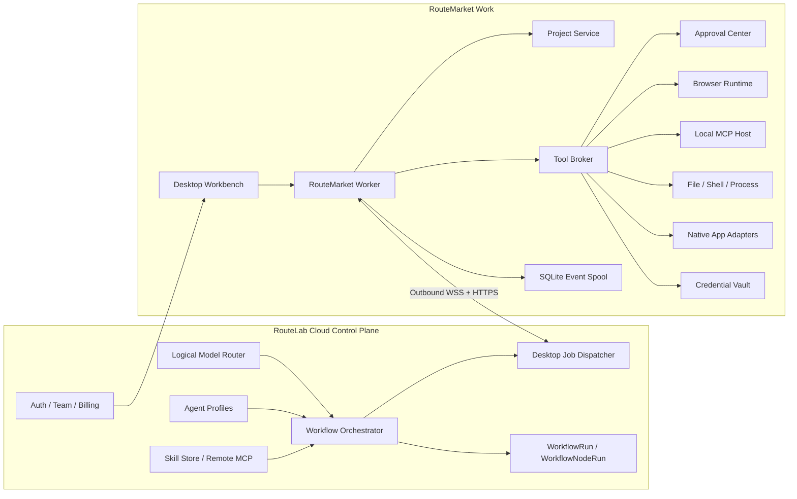

# RouteMarket Work 产品与技术规划

> 状态：架构规划稿
> 日期：2026-07-17
> 目标平台：Windows、macOS
> 云端底座：`D:\PX Labs\PX06-RouteLab`

## 1. 一句话定位

RouteMarket Work 不是 RouteLab 网页版的桌面壳，也不应重写 RouteLab 已有的模型网关、Agent、Skill 和 Workflow 引擎。

它应定位为：

> **以本地文件夹为项目、以 RouteLab 为云端控制面、能够安全调用本机文件、终端、浏览器、本地 MCP 和桌面软件的 AI 工作台与本机执行节点。**

正式命名：

- **RouteMarket Work**：用户使用的 Windows/macOS 桌面产品。
- **RouteMarket Worker**：运行在 RouteMarket Work 内部的本机执行引擎。

可以理解为三种能力的组合：

- Codex 式的“文件夹即项目”和 Agent 工作台。
- n8n 式的可观测、可重试、可编排执行。
- RouteLab 已有的多模型、Agent、Skill、MCP 与多模态创作能力。

## 2. 桌面端真正解决的问题

网页版工作流的能力边界在云端：

- 无法直接访问用户文件夹和项目源码。
- 无法启动本地进程、终端和开发服务器。
- 无法通过 `stdio` 运行本地 MCP Server。
- 无法可靠控制本机浏览器会话。
- 无法调用 Photoshop、Blender、Office、IDE 等本地软件。
- 无法持有只允许留在本机的凭据和会话。
- 网络断开后无法继续纯本地任务。

桌面端的核心价值不是“多一个客户端”，而是新增一个受控的 **Desktop Execution Plane**。

## 3. 产品原则

### 3.1 文件夹即项目

用户选择一个本地文件夹后，它就是一个 Desktop Project。项目不是云端数据库里的空容器，而是真实工作目录。

每个项目可包含：

```text
my-project/
  .routemarket/
    project.json
    permissions.json
    workflows/
    skills/
    memory/
  AGENTS.md
  README.md
  src/
  assets/
```

其中：

- `project.json`：项目 ID、默认 Agent、默认模型、忽略规则、云端关联。
- `permissions.json`：项目允许使用的本地能力。
- `workflows/`：可跟随 Git 管理的工作流定义或引用。
- `skills/`：项目级本地 Skill。
- `memory/`：可选的项目记忆和索引元数据，不存敏感明文。
- `AGENTS.md`：延续 Codex 类产品的项目级 Agent 指令模式。

第一期不要强制创建 `.routemarket`。打开普通文件夹即可使用，只有保存项目设置时才创建。

### 3.2 云端是控制面，桌面是执行面

RouteLab 继续负责：

- 用户、团队、订阅、计费。
- 逻辑模型和 Provider 路由。
- Agent Profile 和 Agent 市场。
- Skill Store 和远程 MCP。
- Workflow 定义、运行事实、节点状态、重试和恢复。
- 云端生成资产与团队协作。

桌面端负责：

- 文件系统、终端、进程。
- 本地浏览器和登录会话。
- 本地 MCP Server。
- 本机软件和 OS 自动化。
- 本地凭据保管。
- 本地审批。
- 项目上下文、索引、预览和设计工作区。

### 3.3 一个混合工作流只能有一个运行协调者

MVP 中，包含云端和本地节点的工作流仍由 RouteLab Orchestrator 持有唯一 `WorkflowRun`。

桌面端作为一种特殊 Worker：

1. 云端编排器推进 DAG。
2. 遇到本地节点时生成 Desktop Job。
3. 指定桌面 Runtime 领取 Job。
4. 桌面执行、审批并持续上报事件。
5. 云端写入现有 `WorkflowNodeRun`，然后继续后续节点。

这样不会出现云端和桌面各维护一套互相冲突的运行状态。

纯本地、离线 Workflow 可以在后续版本提供 Local Run，联网后只同步摘要和产物。

### 3.4 Workflow、Agent、Tool、Approval 必须分层

- **Workflow**：确定性的步骤、顺序、分支、循环、重试和触发。
- **Agent**：在限定目标、模型、工具和预算内自主决策。
- **Tool**：一次具体能力调用，例如读文件、点击浏览器或调用 Excel MCP。
- **Approval**：对高风险 Tool Call 的显式授权，不是普通节点错误。

不能把所有能力都塞进聊天，也不能把 Agent 的每个思考步骤都强行画成节点。

## 4. 核心使用场景

### 4.1 项目 Agent

用户打开代码或设计项目文件夹，选择 Agent 和模型：

- Agent 检索和读取项目文件。
- 修改文件前展示计划或 Diff。
- 运行构建、测试和开发服务器。
- 打开内置浏览器验证结果。
- 将一次成功操作保存为可复用 Workflow。

### 4.2 本地软件工作流

示例：批量生成营销图并写入 PowerPoint。

```text
读取项目 brief
  -> RouteLab 多模型生成文案
  -> RouteLab 图像模型生成素材
  -> 本地 Photoshop MCP 套用模板
  -> 本地 PowerPoint MCP 写入演示文稿
  -> 人工审批
  -> 导出到项目 output/
```

### 4.3 内置交互浏览器

浏览器不是隐藏在后台的爬虫，也不只是 Web 项目预览器，而是 RouteMarket Work 中用户、Agent 和 Workflow 共享的操作界面。

当用户的要求或 Workflow 需要访问网页时：

1. RouteMarket Work 打开一个用户可见的内置浏览器标签页。
2. Agent/Workflow 在标签页中导航、点击、输入、滚动、提取或下载。
3. 当前动作、目标元素和下一步意图在界面中可见。
4. 用户可以随时暂停自动执行并亲自操作网页。
5. 用户完成登录、验证码或人工判断后，可以将控制权交还给 Agent/Workflow。
6. 浏览器结果作为结构化输出进入下一节点。

这是一种 shared control 模式：自动化负责执行重复步骤，用户负责身份、判断和高风险动作。

示例：登录后台、采集数据、生成报告。

```text
定时或手动触发
  -> 在内置浏览器打开目标页面
  -> 用户完成登录或接管操作
  -> Agent 页面导航、填写、点击、提取
  -> Agent 归纳异常
  -> 写入本地 Excel
  -> 有外部提交动作时请求审批
```

### 4.4 设计与创作

桌面端不应首期复制 Figma 或 Adobe，而应先做 AI 驱动的项目创作工作区：

- 文件树和素材库。
- 图片、视频、音频、文档和网页预览。
- Prompt、生成版本、模型和参数记录。
- 画面比较、选择、导出。
- 通过本地 MCP 把结果送到专业软件继续编辑。
- Web 项目可启动本地服务并在内置浏览器实时验证。

## 5. 信息架构

桌面端第一屏应是项目工作台，不是营销页，也不是单一聊天页。

### 5.1 主导航

- 项目
- 工作流
- Agent
- Skills
- MCP
- 内置浏览器
- 运行记录
- 审批中心
- 设置

### 5.2 项目工作台布局

```text
┌──────────────┬────────────────────────────────────┬──────────────────┐
│ 项目/文件树   │ 当前工作区                          │ Agent / Activity │
│              │                                    │                  │
│ Files        │ Editor / Preview / Workflow Canvas │ 对话             │
│ Workflows    │ Browser / Asset Board / Run Detail │ 工具调用时间线   │
│ Skills       │                                    │ 审批             │
├──────────────┴────────────────────────────────────┴──────────────────┤
│ Terminal / Problems / Output / Local Runtime                         │
└─────────────────────────────────────────────────────────────────────┘
```

中心区域根据任务切换，不应把所有功能做成卡片：

- 文件编辑与 Diff
- Workflow Canvas
- 内置浏览器
- 资产预览与比较
- 单次运行回放

右侧 Agent 面板始终能理解当前项目、选中文件、网页、节点和运行。

## 6. 总体架构



桌面端只建立向外连接，不要求用户开放本机入站端口。

## 7. Desktop Runtime 模块

### 7.1 Project Service

职责：

- 打开、关闭和恢复最近项目。
- 文件树、搜索、忽略规则和变更监听。
- 读取 `AGENTS.md`、README 和项目设置。
- 维护项目级上下文索引。
- 把绝对路径转换成受控的 Project URI。

云端永远不应直接收到可执行的本机绝对路径。协议中使用：

```text
project://<projectId>/src/index.ts
```

Runtime 在本机解析 URI，并检查路径是否仍位于项目根目录内。

### 7.2 Tool Broker

所有 Workflow、Agent、Skill 对本地能力的调用都必须经过 Tool Broker。

它统一处理：

- 参数 Schema 校验。
- Capability Grant 校验。
- 路径和进程边界。
- 审批策略。
- 超时、取消、输出截断。
- 审计日志。
- 结构化结果。

Agent 不直接获得 Node.js、Shell 或操作系统 API。

### 7.3 Local MCP Host

第一期支持：

- `stdio` MCP Server。
- 本机或远程 Streamable HTTP MCP Server。
- 工具发现、Schema 快照、健康检查和重启。
- 项目级、用户级和内置三级配置。

建议 Skill/MCP 分层：

```text
project > user-managed > bundled
```

项目配置优先，用户安装其次，内置能力最后。每个本地 MCP Server 独立子进程运行，并配置：

- executable、args、cwd。
- 允许透传的环境变量。
- 项目访问范围。
- 启动超时、调用超时、最大输出。
- 自动重启策略。
- 信任来源和包签名。

RouteLab 当前的 `mcp__<serverId>__<toolName>` 命名可以继续使用。区别不应编码在工具名里，而应由 MCP Server 记录的 `executionLocation` 和 `transport` 决定：

```ts
type McpExecutionLocation = "cloud" | "desktop";
type McpTransport = "stdio" | "streamable_http";
```

当执行目标是 `desktop`，云端将工具调用派发给绑定的 Runtime。

### 7.4 Interactive Browser Runtime

浏览器首先是用户可见、可交互、可接管的执行表面，然后才是自动化工具。它需要同时提供：

- 标签页、地址栏、前进、后退、刷新和下载。
- Agent 当前操作目标高亮。
- 操作时间线和当前执行状态。
- 暂停、继续、单步执行和停止。
- “由我操作”和“交还 Agent”控制权切换。
- 登录、验证码、支付和敏感输入的用户接管。
- 页面截图、DOM/Accessibility Snapshot 和结构化提取。
- 将页面、选中文本或截图加入当前 Agent 上下文。

浏览器分两种会话模式：

1. **Embedded Managed Browser**
   - RouteMarket Work 内置并托管的 Chromium 会话。
   - 用户始终可以在应用内看到并操作页面。
   - 每个项目或自动化配置独立 Profile。
   - 可重复、可截图、可录制操作轨迹。
   - MVP 首选。

2. **Attached Browser**
   - 连接用户现有 Chrome/Edge 会话。
   - 适合复用用户登录状态。
   - 需要 CDP 或浏览器扩展配合。
   - 放在 V1，不作为 MVP 阻塞项。

内置浏览器标签页应能绑定以下上下文：

- 当前 Project。
- 当前 Agent Session。
- 当前 Workflow Run 和 Node Run。
- 当前 Browser Profile。

Workflow 浏览器节点不只返回成功或失败，还应返回：

```ts
type BrowserStepResult = {
  url: string;
  title: string;
  extractedData?: unknown;
  screenshotRef?: string;
  downloadRefs?: string[];
  sessionId: string;
  userIntervened: boolean;
};
```

本地浏览器工具至少包括：

```text
local.browser.open
local.browser.navigate
local.browser.inspect
local.browser.click
local.browser.type
local.browser.select
local.browser.extract
local.browser.screenshot
local.browser.download
local.browser.wait
local.browser.pause_for_user
local.browser.resume
```

涉及提交订单、发消息、发布、删除、付款等外部副作用时，默认进入审批。

### 7.5 File / Shell / Process Runtime

建议工具集：

```text
local.fs.list
local.fs.search
local.fs.read
local.fs.write
local.fs.patch
local.fs.move
local.process.spawn
local.process.status
local.process.stop
local.shell.exec
local.app.launch
```

必须区分：

- 文件读取。
- 文件写入。
- 命令执行。
- 长驻进程。
- 破坏性文件操作。

命令默认在项目根目录执行。长驻进程由 Process Manager 管理，退出桌面端时明确询问是否停止。

### 7.6 Native App Adapters

优先顺序：

1. 软件官方 API 或插件。
2. 软件专用 MCP Server。
3. macOS Shortcuts、AppleScript、Accessibility。
4. Windows UI Automation、PowerShell 或应用 COM API。
5. 最后才考虑坐标式 Computer Use。

MVP 应先打通 2 到 3 个高价值应用，不做“任何软件都能自动点”的承诺。建议候选：

- Excel / PowerPoint
- VS Code
- Photoshop 或 Blender

### 7.7 Credential Vault

本地凭据默认不上传云端：

- macOS 使用 Keychain。
- Windows 使用 DPAPI/Credential Manager。
- 应用层只保存凭据引用 ID。
- Tool Broker 在调用时临时解析。
- 日志、模型上下文和节点输出不得包含凭据明文。

远程 Workflow 只能请求使用某个本地凭据，不能读取凭据内容。

### 7.8 Event Spool

本地使用 SQLite 保存：

- Runtime 状态。
- 项目注册信息。
- 本地 MCP 配置。
- 权限与审批。
- 未上传的运行事件。
- 本地任务和进程状态。

网络中断时继续缓存事件；恢复后按 sequence number 幂等补传。

## 8. Workflow 如何接入本地能力

### 8.1 节点执行位置

在现有 Workflow Node Runtime 上增加：

```ts
type ExecutionTarget = "cloud" | "desktop" | "auto";

type DesktopRequirement = {
  capabilities: string[];
  projectRequired: boolean;
  runtimeId?: string;
};
```

规则：

- 模型、远程 HTTP、云端资产节点通常是 `cloud`。
- 文件、终端、本地 MCP、桌面软件节点必须是 `desktop`。
- 某些 MCP 或浏览器节点可以是 `auto`。
- 本地节点在 Runtime 离线时显示 `blocked_waiting_for_runtime`，不能静默改为云端执行。

### 8.2 建议新增执行器

```text
project.context
local.fs
local.shell
local.process
local.browser
local.mcp
local.app
human.approval
desktop.trigger.file_changed
desktop.trigger.folder_added
desktop.trigger.app_event
desktop.trigger.hotkey
```

不用为每个本地工具都做一个巨大的画布节点。可以由一个执行器根据 `operation` 派发具体 Tool，同时保留类型化端口。

### 8.3 混合运行协议

建议新增 RouteLab Desktop API：

```text
POST   /api/app/v1/desktop/runtimes/register
POST   /api/app/v1/desktop/runtimes/:id/heartbeat
PUT    /api/app/v1/desktop/runtimes/:id/capabilities
GET    /api/app/v1/desktop/runtimes
DELETE /api/app/v1/desktop/runtimes/:id

WSS    /api/app/v1/desktop/runtimes/:id/channel

POST   /api/app/v1/desktop/jobs/:jobId/ack
POST   /api/app/v1/desktop/jobs/:jobId/events
POST   /api/app/v1/desktop/jobs/:jobId/complete
POST   /api/app/v1/desktop/jobs/:jobId/fail
POST   /api/app/v1/desktop/jobs/:jobId/cancel-ack
```

Runtime 注册时上报 Capability Manifest：

```json
{
  "runtimeId": "desktop_xxx",
  "platform": "windows",
  "appVersion": "1.x",
  "projects": ["project_xxx"],
  "capabilities": [
    "local.fs.read",
    "local.fs.write",
    "local.shell.exec",
    "local.browser.managed",
    "local.mcp.stdio"
  ],
  "mcpServers": [
    {
      "id": "mcp_excel",
      "name": "Excel",
      "toolsHash": "sha256:..."
    }
  ]
}
```

每个 Job 必须包含：

- `jobId`、`runId`、`nodeRunId`。
- `executorKey`、输入、超时和取消令牌。
- 所需项目和能力。
- 审批策略。
- 幂等键。
- 结果大小和产物上传策略。

### 8.4 与现有 RouteLab 的复用关系

可直接复用云端能力和数据语义：

- `WorkflowRun` / `WorkflowNodeRun`。
- `executorKey` 注册和节点级执行事件。
- retry、timeout、continue-on-error、resume。
- `control.condition`、`control.loop`。
- `agent.autonomous` 和统一 SkillInvoker。
- 逻辑模型、Provider 路由与计费。
- Agent Profile、Skill Store、远程 MCP。

需要新增：

- Desktop Runtime、Capability、Job 和 Approval 数据模型。
- 本地执行器派发器。
- Runtime 在线状态和事件通道。
- MCP 的 transport 与 execution location。
- 项目引用和桌面节点定义。
- 大结果及本地产物的上传/引用协议。

这里的“复用”指通过 RouteLab API 和版本化协议使用现有云端能力，不要求 RouteMarket Work 与 RouteLab 共享前端组件、TypeScript 包或业务源码。

### 8.5 桌面节点注册表是云端节点的超集

RouteMarket Work 的 Workflow 节点数量和类型必然比 RouteLab Web 更丰富，因为桌面端可以发现和调用当前设备上的文件、进程、浏览器、MCP、Skill 和本地软件。

桌面 Workflow Studio 合并三个节点来源：

1. **Cloud Registry**
   - RouteLab API 返回的模型、远程 MCP、云端资产、Agent 和控制流节点。
2. **Desktop Built-in Registry**
   - RouteMarket Work 内置的文件、Shell、进程、浏览器、审批和本地触发器节点。
3. **Local Extension Registry**
   - 根据当前设备已安装的 MCP Server、Skill、软件 Connector 和系统能力动态生成的节点。

建议使用稳定命名空间：

```text
cloud.model.*
cloud.asset.*
control.*
agent.*
local.fs.*
local.shell.*
local.process.*
local.browser.*
local.app.*
desktop.trigger.*
mcp__<serverId>__<toolName>
skill.local.*
```

每个桌面节点定义至少包含：

```ts
type DesktopWorkflowNodeDefinition = {
  executorKey: string;
  definitionVersion: number;
  source: "cloud" | "desktop_builtin" | "local_extension";
  executionTarget: "cloud" | "desktop" | "auto";
  inputSchema: Record<string, unknown>;
  outputSchema: Record<string, unknown>;
  requiredCapabilities: string[];
  portability: "portable" | "requires_connector" | "device_bound";
  definitionHash: string;
};
```

可移植性规则：

- `portable`：任何安装兼容版本 RouteMarket Work 的设备都能执行。
- `requires_connector`：目标设备必须安装对应 MCP、Skill 或软件 Connector。
- `device_bound`：依赖特定设备、账号会话、文件路径或软件实例，默认绑定 Runtime。
- 保存 Workflow 时记录节点定义版本和快照摘要。
- 打开 Workflow 时根据当前 Capability Manifest 标记可用、缺失连接器、设备不匹配或版本不兼容。
- 缺少本地能力时节点进入 `blocked_missing_capability`，不能自动替换成云端节点。

混合 Workflow 可以包含桌面专属节点并保存到 RouteLab。RouteLab 保存公共节点外壳、连线、配置、执行目标、能力要求和定义版本；桌面 Worker 在执行前使用本地 Schema 再次校验具体配置。

RouteLab Web 遇到无法识别的桌面节点时，应根据保存的定义快照显示通用只读节点，并完整保留未知字段、端口和连线，不能因为网页版不支持就删除或重写节点。

### 8.6 两端实现独立，只共享协议

RouteLab Web 与 RouteMarket Work 分别维护自己的 Workflow Studio：

- 两边可以都使用 React Flow，但组件、状态管理、交互逻辑和样式各自在所属仓库实现。
- RouteMarket Work 不依赖 RouteLab 的私有前端包或业务源码。
- RouteLab 不依赖 RouteMarket Work 的桌面 UI 实现。
- 两端只共享公开 API、OpenAPI/JSON Schema、Workflow `schemaVersion`、`executorKey`、执行事件和 Desktop Job 协议。
- RouteMarket Work 可以从公开协议生成自己的 API Client，但生成结果保存在桌面仓库中。
- 协议兼容通过固定测试样例和 conformance tests 验证，而不是通过共享运行时代码保证。

这种边界允许 RouteMarket Work 独立开源，同时保留 RouteLab 模型路由、计费、云端 Workflow Orchestrator 和商业能力的闭源边界。

## 9. Agent 与多模型体验

模型切换应存在于三个层级：

- 当前对话临时选择。
- Agent Profile 默认模型。
- Workflow 节点固定或自动模型。

推荐提供：

- `Auto`：继续使用 RouteLab 逻辑模型和 fallback。
- 指定逻辑模型。
- 高级模式下指定 Provider/Route，遵循账户权限。
- 每个 Agent 可设置工具、最大轮次、预算和本地权限。

本地 Tool 的 Schema 可以进入模型上下文，但本地文件内容应按需读取，不能在项目打开时无差别上传整个目录。

后续可支持 Ollama、LM Studio 等本地 OpenAI-compatible endpoint，但不应成为 MVP 前置，也不应另建一套与 RouteLab 冲突的模型路由体系。

## 10. 权限与审批模型

### 10.1 权限作用域

权限至少包含：

- User：这个用户是否允许某项本地能力。
- Device：这台设备是否提供该能力。
- Project：当前项目是否授权。
- Workflow/Agent：当前执行主体是否被允许。
- Invocation：这一次调用是否需要临时批准。

### 10.2 风险等级

| 等级 | 示例 | 默认策略 |
|---|---|---|
| R0 只读 | 列目录、读文件、截图、提取网页 | 项目授权后允许 |
| R1 可恢复写入 | 新建文件、修改项目文件、生成导出物 | 展示 Diff，可按项目记住 |
| R2 执行与外部副作用 | 运行命令、发邮件、提交表单、操作软件 | 每次或每会话审批 |
| R3 高风险 | 删除、付款、发布、安装代码、修改系统配置 | 每次审批，不允许静默记住 |

### 10.3 Approval Center

审批卡片必须回答：

- 谁在请求：Workflow、Agent、Skill。
- 要做什么：工具和人类可读动作。
- 对哪里做：文件、网页、应用、账号。
- 输入摘要和可能副作用。
- 允许一次、允许本次运行、拒绝。

高风险操作不提供“永久允许”。

## 11. n8n 与 OpenClaw 的借鉴边界

### 11.1 从 n8n 借鉴

- Orchestrator 与 Worker 分离，Desktop Runtime 类似边缘 Worker。
- 执行记录、节点级输入输出和错误可见。
- 失败后从节点重跑，而不是整条流程重做。
- Sub-workflow、触发器、队列和并发控制。
- AI Tool Call 进入 Human-in-the-loop。

不照搬：

- 不追求首期拥有数百个 SaaS 节点。
- 不让纯节点画布成为所有任务的唯一入口。
- 不让用户为了读一个文件也必须搭 Workflow。

### 11.2 从 OpenClaw 借鉴

- Gateway/Node 的控制面与设备能力分离。
- 本地 Browser、Node、Skill 和设备能力。
- bundled、managed、workspace 的 Skill 分层。
- 本地 Skill 安装等同执行代码，必须有信任边界。

不照搬：

- 不把所有能力都围绕聊天展开。
- 不把 Workflow 的可观测性让位给 Agent 自主循环。
- 不让桌面端形成独立于 RouteLab 的第二套账号和能力体系。

## 12. Electron 与 Tauri 选型

| 维度 | Electron | Tauri 2 |
|---|---|---|
| Chromium 一致性 | 自带 Chromium，跨平台一致 | 使用系统 WebView，平台差异更明显 |
| Node/MCP 生态 | 可直接使用 Node、stdio、Playwright 等生态 | 通常需要 Rust 命令或 Node sidecar |
| 内置浏览器控制 | 更直接，可管理 WebContents 和独立 session | 需要更多插件或 sidecar 组合 |
| 包体和内存 | 较大 | 较小 |
| 权限模型 | 需要自行严格设计 preload/IPC | Capability/Permission 模型较清晰 |
| TypeScript/API 协议实现效率 | 高 | 中 |
| MVP 速度 | 高 | 中 |

**建议 V1 使用 Electron。**

原因不是 UI 开发方便，而是本产品的核心刚好依赖：

- 稳定且一致的 Chromium。
- Node 子进程和 `stdio` MCP。
- 文件、Shell、Playwright/CDP。
- 可以在不共享 RouteLab 源码的前提下，高效实现公开 API、Schema 和 TypeScript 协议客户端。

为避免长期锁死：

- Local Runtime 独立于 Renderer。
- UI 只通过版本化 IPC 调用 Runtime。
- Runtime 与云端使用标准 HTTPS/WSS。
- 将来即使更换 Shell，Local Runtime 协议仍可复用。

### 12.1 建议进程结构

```text
Electron Main
  ├─ Window / Tray / Deep Link / Update
  ├─ Secure Preload IPC
  └─ Local Runtime Utility Process
       ├─ Project Service
       ├─ Tool Broker
       ├─ MCP Process Supervisor
       ├─ Browser Controller
       ├─ Process Manager
       ├─ Credential Vault
       └─ SQLite
```

Renderer 必须开启 context isolation，禁用 Node integration，不直接接触文件系统和密钥。

## 13. 分期路线

### Phase 0：协议与安全地基

目标：先证明 RouteLab 能稳定把一个本地节点派发到桌面并收到结果。

交付：

- Electron 基础壳、登录、自动更新和签名准备。
- Local Runtime、SQLite、日志。
- Runtime 注册、心跳、WSS 通道。
- Capability Manifest。
- Tool Broker 和审批原型。
- RouteLab 新增 Desktop Job 最小闭环。

验收：

- 桌面离线、重连、重复事件不会造成节点重复执行。
- 云端可取消本地 Job。
- 未授权能力无法执行。

### MVP：文件夹项目 + 本地工具 + 内置浏览器 + Local MCP

目标：形成用户能明显感知的桌面端优势。

交付：

- 打开文件夹即项目、最近项目。
- 文件树、搜索、读取、Patch、Diff。
- 终端和长驻进程。
- Agent/模型选择，接入 RouteLab Chat 与 Agent。
- Embedded Managed Browser 的可见导航、点击、输入、提取、截图和用户接管。
- `stdio` Local MCP 安装、启停、工具发现和调用。
- 项目级权限与 Approval Center。
- 本地调用时间线和运行日志。

验收场景：

1. 打开一个 Web 项目，让 Agent 修改代码、启动服务并在内置浏览器验证。
2. 在 Workflow/Agent 中调用本地 Excel MCP 修改项目内工作簿。
3. Workflow 在内置浏览器打开后台，用户接管完成登录，再交还 Agent 提取数据并写入项目文件。

### V1：混合 Workflow 工作台

目标：把本地能力正式纳入 RouteLab Workflow。

交付：

- Workflow Canvas 桌面节点。
- `cloud/desktop/auto` 执行位置。
- 混合运行时间线和节点级重跑。
- 文件变更、文件夹新增、快捷键和本地定时触发器。
- Attached Browser。
- 项目级 Skill。
- 2 到 3 个本地软件连接器。
- 设计/资产预览、版本比较和导出。
- Sub-workflow 与可复用本地动作。

验收：

- 一个运行中可交替执行云端模型、本地浏览器、本地 MCP 和人工审批。
- 关闭桌面再恢复后，不重做已成功节点。
- 本地节点输出可以传给云端节点，但敏感字段按策略脱敏。

### V2：本地自动化平台

候选能力：

- 纯本地离线 Workflow。
- 后台调度和系统托盘无人值守运行。
- 团队级设备与权限策略。
- 本地模型和本地 Embedding。
- 多 Agent 协作和长任务。
- 本地软件连接器市场。
- 浏览器录制转 Workflow。
- 视觉 Computer Use，仍受审批和应用白名单限制。

## 14. 首期明确不做

- 不重写 RouteLab 模型网关和计费。
- 不复制 RouteLab Workflow Orchestrator。
- 不做完整 n8n 节点市场。
- 不做通用 Figma/Photoshop 替代品。
- 不默认上传整个项目文件夹。
- 不提供无限制 Shell 或无审批的高风险 Agent。
- 不承诺坐标点击方式控制所有本机软件。
- 不先做复杂离线混合运行。
- 不在 Renderer 中运行 Skill、MCP 或保存密钥。

## 15. 推荐的首批产品切片

按价值和架构验证顺序：

1. **Folder Project**
   - 打开文件夹、项目指令、文件检索、最近项目。
2. **Local Agent Tools**
   - 文件读写、Patch、终端、进程、Diff、审批。
3. **Interactive Browser**
   - Agent/Workflow 在用户可见的内置浏览器中操作网页，用户可随时接管。
4. **Local MCP**
   - 以 Excel 或 VS Code MCP 打通本地软件。
5. **Hybrid Workflow**
   - 云端模型节点 + 本地节点 + Approval 的完整运行。
6. **Creative Workspace**
   - 素材预览、比较、模型生成记录、本地软件导出。

这个顺序能最快验证桌面端是否真正带来网页版无法提供的价值。

## 16. 需要先拍板的架构决策

建议直接采用以下默认答案：

| 决策 | 建议 |
|---|---|
| 桌面框架 | Electron |
| 项目模型 | 文件夹即项目 |
| 混合 Workflow 协调者 | RouteLab 云端 Orchestrator |
| 本地连接方式 | 桌面主动建立 WSS，HTTPS 回调 |
| 本地 MCP | MVP 支持 stdio 和 Streamable HTTP |
| 浏览器 | MVP Embedded Managed，V1 Attached |
| 本地存储 | SQLite + OS Credential Vault |
| 本地工具入口 | 统一 Tool Broker |
| 高风险动作 | Human Approval |
| 本地 Skill 优先级 | project > user-managed > bundled |
| 本地模型 | V2，不阻塞 MVP |

## 17. 开源、许可与商业化策略

### 17.1 总体策略

RouteMarket Work 采用 **Open Core + Fair-code** 的分层策略：

> 开放需要用户信任、开发者扩展和生态共建的本地执行基础；保留完整桌面产品的商业使用限制；通过 RouteLab 云端服务、模型用量、团队治理和生态交易盈利。

开源或源码公开不是为了放弃商业化，而是降低用户将文件、终端、浏览器、凭据和本地软件交给 Agent 的信任门槛。商业壁垒不应只建立在桌面安装包上，而应建立在云端协调、模型资源、可靠性、安全体系、官方分发和生态网络上。

### 17.2 许可证分层

#### Apache-2.0 开源层

建议使用 Apache-2.0 发布：

- RouteMarket Worker 的基础执行框架。
- Local MCP Host 和 MCP Connector SDK。
- Desktop Runtime 与 RouteLab 通信的公开协议和类型定义。
- Capability Manifest、Desktop Job 和运行事件 Schema。
- 文件、终端、进程、浏览器等基础 Tool Adapter 接口。
- 示例 Skill、示例 MCP Server、示例 Connector 和开发文档。

这一层允许社区审查本地执行安全、开发连接器并适配新的本地软件。Apache-2.0 同时提供清晰的专利授权，比仅采用 MIT 更适合作为生态 SDK 和协议实现许可证。

#### Fair-code 桌面产品层

完整的 RouteMarket Work 桌面产品源码公开，但使用带商业限制的 Fair-code 许可证。默认允许：

- 个人免费使用。
- 企业内部使用社区版。
- 查看、审计和修改源码。
- 自行构建供本人或本组织内部使用。
- 开发并发布兼容的 Skill、MCP Server 和 Connector。

未经商业授权默认不允许：

- 将 RouteMarket Work 改名、白标后销售。
- 向第三方提供与 RouteMarket 竞争的托管服务。
- 将完整桌面产品嵌入收费产品并以其核心能力获利。
- 收费分发修改版或绕过官方商业功能限制。
- 冒用 RouteMarket 名称、商标、签名或官方兼容认证。

正式发布前需要由法律顾问确定最终许可证文本。可参考 n8n Sustainable Use License 的边界表达，但不直接复制其许可证。

#### 闭源商业层

以下能力继续由 RouteLab 或商业模块闭源提供：

- RouteLab 云端控制面和混合 Workflow Orchestrator。
- 逻辑模型路由、Provider 资源池、fallback 和成本优化。
- 计费、额度、风控、资源调度和服务可靠性系统。
- Team/Enterprise 的组织权限、审计、策略和设备治理。
- 官方市场运营、支付、签名、兼容认证和安全检测。
- 私有部署、企业连接器、高级合规模块和商业支持。

### 17.3 免费版边界

Community 版本地能力应足够完整，避免把开源版做成不可使用的演示版：

- 文件夹即项目。
- 本地文件读取、写入、Patch 和 Diff。
- 本地终端与进程管理。
- Embedded Managed Browser 的基础人工与 Agent 操作。
- Local MCP 的安装、发现和调用。
- 本地权限、审批和运行日志。
- 用户自带模型密钥或本地模型时的基础 Agent 使用。

本地文件、终端、浏览器、MCP 和本地算力来自用户自己的设备，原则上不按 Tool Call 次数收费。只有使用 RouteLab 的托管服务、模型资源或商业能力时才产生订阅或用量费用。

### 17.4 收入结构

#### 统一会员与账单

RouteMarket Work 不建立独立于 RouteMarket 的第二套会员、账户或账单体系：

- RouteMarket Free、Pro、Team、Enterprise 是账户或组织级统一会员。
- 同一个会员身份同时覆盖 RouteMarket Web、RouteLab 云端能力和 RouteMarket Work 桌面端权益。
- 桌面端登录后从 RouteLab 获取 Entitlement，不在本地维护独立订阅状态。
- 用户不需要分别购买网页版会员和桌面端会员。
- 模型、图像、视频等生成资源继续通过 RouteMarket Credits 独立按用量结算。
- 额外在线 Worker、设备并发、商业 Connector、私有部署和企业支持可以作为增值项计费，但不形成另一套基础会员。

建议将产品权益建模为统一的 Entitlement，例如：

```text
work.desktop.basic
work.hybrid_workflow
work.remote_trigger
work.project_sync
work.browser.advanced
work.worker.max_devices
work.worker.max_concurrency
team.shared_projects
enterprise.device_policy
```

RouteMarket Work 只根据 Entitlement 开启对应能力，订阅购买、续费、升级、退款、额度和发票仍全部由 RouteLab 统一处理。

#### RouteMarket Pro 的 Work 权益

RouteMarket Pro 按月或按年订阅，其中的 Work 权益主要提供：

- RouteLab 云端与本地混合 Workflow。
- 云端定时、Webhook 和远程触发本机 Worker。
- 多设备同步、项目备份和运行历史。
- 断点恢复、更高并发和更长任务保留。
- 高级浏览器自动化、运行回放和远程接管。
- 官方签名 Connector、优先更新和支持。

早期可测试 `49～99 元/月` 的价格区间，AI 模型和云端生成资源独立计费。

#### 模型与智能执行用量

继续复用 RouteLab 已有的多模型路由和计费体系：

- 用户购买 RouteMarket Credits。
- 按实际模型、图像、视频、音频和云端执行资源消耗计费。
- 平台通过集中采购、智能路由和服务费获得毛利。
- 允许 BYOK，但高级路由、统一账单、fallback、审计和团队策略仍属于付费服务。

模型差价是高频收入，不应成为唯一利润来源。订阅收入负责稳定性，企业能力负责主要利润。

#### Team 与 Enterprise

团队和企业版本提供：

- 团队项目、共享 Workflow、Agent、Skill 和 Connector。
- RBAC、审批策略、审计日志和数据保留。
- Worker 设备管理、远程禁用和能力白名单。
- 私有 Skill 市场和官方签名策略。
- SSO、私有模型、私有网络和数据边界。
- RouteLab 私有部署、SLA、安全支持和定制连接器。

Team 可采用按席位订阅加用量计费；Enterprise 采用年度合同，按席位、设备、执行规模和部署方式报价。

#### RouteMarket 生态市场

市场可交易：

- Workflow 模板。
- Agent 和 Skill。
- MCP Server 与本地软件 Connector。
- 行业自动化套件。
- Prompt、多模态设计模板和专业数据服务。

平台通过交易服务费、官方认证、安全检测、企业私有市场和推广位盈利。建议交易抽成初始区间为 `15%～30%`，但市场收入不作为 MVP 阶段的主要收入目标。

### 17.5 收入优先级

1. **近期：Pro 订阅 + RouteLab 模型用量**
2. **中期：Team/Enterprise + 私有部署**
3. **后期：市场抽佣 + 行业连接器生态**

核心商业公式：

> RouteMarket Work 免费解决“在我的电脑上做事”；RouteLab 收费解决“跨设备长期可靠地调度、使用模型、协作和治理自动化”。

### 17.6 官方分发与品牌保护

即使源码公开，官方版本仍通过以下方式形成可信分发优势：

- RouteMarket 商标和产品名称保护。
- Windows/macOS 官方代码签名与公证。
- 官方自动更新通道。
- Worker、Skill、MCP 和 Connector 包签名。
- 官方兼容认证和安全扫描。
- RouteLab 云端服务的协议兼容、稳定性和 SLA。

社区可以修改和构建源码，但不能将修改版描述为 RouteMarket 官方产品，也不能使用官方签名和服务标识。

### 17.7 建议发布节奏

1. 私有完成 Phase 0 和 MVP，先验证安全模型与混合执行闭环。
2. 完成本地执行、浏览器、MCP 和更新机制的安全审计。
3. 开源 Apache-2.0 基础组件、协议、SDK 和示例。
4. 以 Fair-code 发布完整 RouteMarket Work 源码和 Community 构建说明。
5. 上线 Pro 和 RouteLab 用量计费。
6. 在权限、审计和设备治理成熟后推出 Team/Enterprise。
7. 生态规模形成后开放付费市场和官方认证。

## 18. 官方参考

- n8n Queue Mode：<https://docs.n8n.io/hosting/scaling/queue-mode/>
- n8n Debug and re-run：<https://docs.n8n.io/workflows/executions/debug/>
- n8n Sub-workflows：<https://docs.n8n.io/flow-logic/subworkflows/>
- n8n Human fallback：<https://docs.n8n.io/advanced-ai/human-fallback/>
- n8n Sustainable Use License：<https://docs.n8n.io/privacy-and-security/sustainable-use-license/>
- OpenClaw License：<https://github.com/openclaw/openclaw/blob/main/LICENSE>
- MCP Transports：<https://modelcontextprotocol.io/specification/2025-11-25/basic/transports>
- OpenClaw Skills：<https://docs.openclaw.ai/tools/skills>
- OpenClaw Browser：<https://docs.openclaw.ai/tools/browser>
- Electron Process Model：<https://www.electronjs.org/docs/latest/tutorial/process-model>
- Electron Security：<https://www.electronjs.org/docs/latest/tutorial/security>
- Tauri Capabilities：<https://v2.tauri.app/security/capabilities/>
